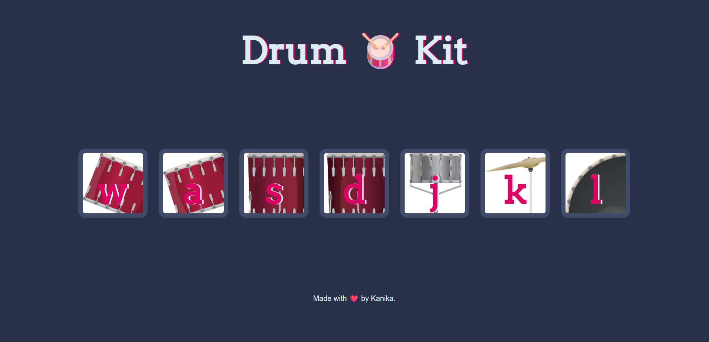

# virtual-drum-kit
# 🥁 Virtual Drum Kit

A fun and interactive virtual drum kit built using HTML, CSS, and JavaScript. Play drum sounds using mouse clicks or keyboard keys!

## 🎯 Features

- Responsive UI
- Play drum sounds using keyboard or mouse
- Animated buttons when pressed
- Clean, responsive design
- Easy to use and fun to play
  
## 🚀 Live Demo

[Click here to try it out!](https://kanika0004.github.io/virtual-drum-kit/).

## 🛠️ Tech Stack

- HTML5
- CSS3
- JavaScript (Vanilla JS)

## 🧠 How It Works

Each drum button is linked to a sound file. When a button is clicked or its corresponding keyboard key is pressed, the sound plays and a brief animation is triggered.

## 📸 Screenshots

